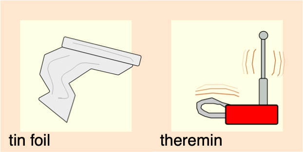

# Touch-Board-Workshops

These activities use an Arduino sketch called TinFoilTheremin.

If you're already familiar with the platform, you can download the sketch from the green link above.

Everyone else: please watch this space for instructions! I'm in the process of uploading about ten years of work to GitHub, and it's taking time ;)
